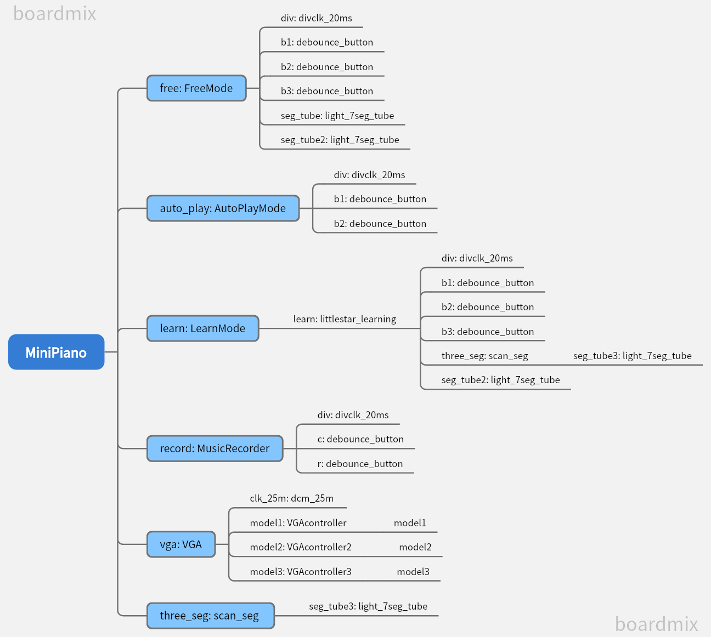
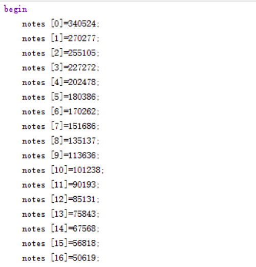
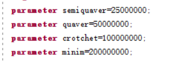

# Digital Logic Project

### A Electronic Piano Learning Machine

#### Team division of labor (work and contribution percentage of each member) 

|       | **Student Name**           | Student ID | Main work                                                    | contribution percentage |
| ----- | -------------------------- | ---------- | ------------------------------------------------------------ | ----------------------- |
| **1** | 叶航见<br />（Ye Hangjian) | 12212012   | 1. Basic functions of Free Mode <br />2. Basic functions of AutoPlayMode <br />3. Basic functions of Learn Mode<br /<br />4. Adjust the position of keys | 50%                     |
| **2** | 张伟祎<br />（Zhang Weiyi) | 12210653   | 1. Top Module<br />2. light_7_seg_tube and the indicator light of all module<br />3. VGA<br />4. save the performance records | 50%                     |

lab: Wed 5-6


#### development plan schedule and implementation status 

- Week12
  - Implement free mode
  - Construct the modules of control buzzers, LED lights and seven segments.
- Week13
  - Implement auto mode
  - Write the file for `the little star`, `Happy Birthday` and `春よ、来い`  
  - Switch to different songs


- Week14

  - Implement learning mode

- Week 15

  - Adjust the position of keys
  - Save the performance records in the music library
  - VGA


#### System Function List

1. Support switching between three basic modes and one advanced mode (free mode, automatic performance mode, learning mode and recording music mode) by using the small white keys at the bottom of EGO1.
2. 【bonus】The VGA can show the mode number and name on the screen. 
3. Free Mode

  (1). Pressing the corresponding keys will produce the corresponding notes and light the corresponding lightsPress any switches and the electronic keyboard will play the corresponding 7 notes:  do, re, mi, fa, so, la, xi. 

  (2). Using the switches 'tone up', 'tone down' to adjust note: pressing a specific key can pop up notes to higher octaves or lower octaves.

  (3). 【bonus】Users can adjust the position of keys according to their usage habits.
4. Aotomatic performance Mode

  (1). We added three musics to the library and the learning machine can automatically play songs and switch to play these three songs. 

  (2). The user can also pause and restart at any time of palying the songs.

  (3). 【bonus】We explored different various rhythm of music in the third song `春よ、来い` , which has 17 different notes in different tone, and for different time interval in rhythm.

  (4). We display track number on the seven digital tubes, so users can flipp back and forth through buttons. The seven segment digital tube displays the content of the music library by its number, for example, 'no.1'.

  (5). During automatic performance, the lights will indicate the song's playing position and duration: When a note appears, the light will be lit above the note, and after the note is played, the light will be turned off until the song ends.

  (6). 【bonus】The VGA can show the song's number and name on the screen. 
5. Learning mode

  (1). According to the order and duration of the notes, the LED light above the piano keys will light up to guide the user to play correctly. After the user turns on the corresponding key, the LED light will go out, and then the other light corresponding to the next note will be lit.

  (2). Based on the user's performance status, display the rating of the user's performance level on a seven segment digital tube or LED light. 

  (3).【bonus】Teal-time changes in ratings are provided based on the difference between the user's button time and the standard time.  When the difference is greater than 25000000 ns, the grade will decrease by one.

  (4). We create accounts for at least three users and after a new play, the user can clinck confirm button to update his ratings based on his new performance records.
6. Recoring music mode

  (1). 【bonus】For user performance records, user can choose whether to save them in the music library. The saved content will include the tone and the time interval. After pressing the confirm button, the user saves it in the device. After pressing the replay button, the user can replay it.


#### System usage instructions


#### System structure description 




#### Sub module function description

- FreeMode
  - input wire clk , // Clock signal
  - input wire [6:0] note, // input note do, re, mi, fa, so, la, xi
  - input key1, key2, //to raise or lower the tone
  - input key_confirm, //to confirm the note in adjust_mode
  - input rst,//reset 
  - input adjust_mode, // use to get into the key-adjusting position
  - output wire s,
  - output wire speaker, // Buzzer output signal--sound
  - output wire [6:0] light, // light above the corresponding note to indecate the note
  - output [7:0] seg_out,  seg_en, // 7 sections digital display tube on the left, choose the left-most one
  - output [7:0] seg_out2,  seg_en2// 7 sections digital display tube on the right, choose the right-most one
- AutoPlayMode
  - input clk,
  - input key1, // up to choose other song
  - input key2, // down to choose other song
  - input rst, //reset 
  - input key,
  - output [3:0] segs, [7:0] seg_out,//7 sections digital display tube on the left, choose the left three
  - output reg [6:0]light, // light above the corresponding note to indecate the note
  - output reg speaker,
  - output reg s
- LearnMode
  - input clk,
  - input rst,
  - input [6:0] note, // input note do, re, mi, fa, so, la, xi
  - input key1,
  - input key2,
  - input confirm,
  - output speaker,
  - output s,
  - output wire [6:0]light, // the light will light up to guide the user to play the corresponding note
  - output [7:0] seg_out, [3:0] segs, //7 sections digital display tube on the left
    - the left three--current user 
    - the forth on the left--level before
  - output [7:0] seg_out2, seg_en2, //7 sections digital display tube on the right
    - the right-most one--current level in this game
- MusicRecord
  -  input wire clk,
  - input wire rst,
  - input [6:0] play, // input note do, re, mi, fa, so, la, xi, user can use these to paly his own songs
  - input wire confirm, //confirm the own-played song to be saved
  - input wire replay, // replay the saved own-played song
  - output reg [6:0] light,  // light above the corresponding note to indecate the note
  - output speaker,
  - output s


#### Implementation instructions for bonus

1. In top module, the **VGA** can show the mode number and name on the screen. In Auto performance mode, the **VGA** can show the song number and name on the screen. 

   - We use normal picture ended with '.png' or '.jpg' to transform into '. bmp' and constrain its format to 300*200, 24bit.
   - We use the application program `BMP2Mif` to generate the `.coe` files of these pictures.
   - In the IP Catalog, we use `Clocking Wizard` to form a 25MHz clock.
   - In the IP Catalog, we use `Block Memory Generator` to generator these coe file. Where we choose`Single Port ROM` as`Memory Type`, `Port A Depth` is `300*200=60000`. `Enable Port` Type is `Always Enable`. Finally use `Load init File` to find the coe file.

2. Users can **adjust the position of keys** according to their usage habits.

   ```verilog
    if(~adjust_mode)
                  begin//reset addr
                      addr<=4'b0001;
                       //control the tone
                       pre_pulse1<=now_pulse1;
                       now_pulse1<=key1_pulse;
                       pre_pulse2<=now_pulse2;
                       now_pulse2<=key2_pulse;
                       pre_pulse3<=now_pulse3;
                       now_pulse3<=key3_pulse;
                       if(~pre_pulse2 & now_pulse2)
                       begin
                       if(cnt>4'b0011) cnt<=cnt-4'b1;
                       else cnt<=cnt;
                       end 
                       else if(~pre_pulse1 & now_pulse1)
                       begin
                       if(cnt<4'b0101) cnt<=cnt+4'b1;
                       else cnt<=cnt;
                       end 
                       else
                       begin
                           cnt<=cnt;
                       end
                   end
               else 
                   begin
                       pre_pulse3<=now_pulse3;
                       now_pulse3<=key3_pulse;
                       real_notes[addr]<=point;
                       if(~pre_pulse3 & now_pulse3)//confirm this node
                       begin
                           addr<=addr+1'b1;
                       end
                       else addr<=addr;
                   end
           end  
   ```

3. We explored **different various rhythm** of music in the third song `春よ、来い` , which has **17 different notes** in different tone, and **4 different time interval** in rhythm. 
           

4. **Real-time changes in ratings** are provided based on the difference between the user's button time and the standard time.  **When the difference is greater than 25000000 ns, the grade will decrease by one.**
   We use `counter_deduct` to record the time out of range.

   ```verilog
   if(counter_beat>=allnote[state][1])
           begin
               light<=7'b0000000;
               if (note[allnote[state][0]-1]) 
               begin
                   if(counter_deduct<50000000)
                       begin
                           counter_deduct<=counter_deduct+1'b1;
                       end
                   else 
                       begin
                           if(grade>0)grade<=grade-1'b1;
                           else grade<=grade;
                           counter_deduct<=0;
                       end
               end
   ```

   

5. For user performance records, user can choose whether to save them in the music library. The saved content will include the tone and the time interval. **After pressing the confirm button, the user saves it in the device. After pressing the replay button, the user can replay it.**

   ```verilog
   reg [31:0] recorded_data[MAX_RECORD_LENGTH:0][1:0];
   ```

   ```verilog
    // store the music
   if(~save) 
                   begin
                       pre_play <= now_play;
                       now_play<=play;
                       if(state!=MAX_RECORD_LENGTH)
                       begin
                           case(play)
                               7'b1000000: begin
                                       recorded_data[state][0]<=1;
                                       light <= 7'b1000000;
                               end
                               // ......
                               // same as above case
                               default: begin
                                       light <= 7'b0000000;
                               end
                           endcase
                           // last time 
                           if(pre_play==now_play)
                               begin
                                   counter_beat<=counter_beat+1'b1; 
                                   if(point>0&counter<notes[point]) 
                                   begin
                                       counter<=counter+1'b1;
                                   end
                                   else
                                   begin
                                       pwm=~pwm;
                                       counter<=0;
                                   end 
                               end
                           else 
                               begin
                                   pwm<=1'b0;
                                   recorded_data[state][1]<=counter_beat;
                                   state <= state+1;
                                   counter_beat<=0;
                               end
                       end
                   end
   ```

   ```verilog
   // read the music
   else 
           begin
               if(~pre_replay & now_replay) start<=~start;
               else start<=start;
               if(~start)
               begin
                   light<=7'b0000000;
                   counter<=0;
                   counter_beat<=0;
                   state<=0;
                   counter_stop<=0;
                   start = 1'b1;
               end
              else
              begin
                 if(state<=max_state)
                 begin
                     case(recorded_data[state][0])
                         // light......
                         default: light <= 7'b0000000;
                     endcase
                       if(counter_beat<recorded_data[state][1])
                       begin
                           counter_beat<=counter_beat+1'b1;
                               if(recorded_data[state][0]>0&counter<notes[recorded_data[state][0]])
                                   begin
                                       counter<=counter+1'b1;
                                   end
                               else 
                                   begin
                                       pwm=~pwm;
                                       counter<=0;
                                   end
                       end  
                       else
                       begin
                           pwm<=0;
                           state <= state+1'b1;   
                           counter_beat<=0;
                       end
                 end
               end
   ```

6. Creative idea:

​	(1).In the free playback module, we have realized **the pausing and continuing playing of songs** for the needs of users.

```verilog
pre_pulse1<=now_pulse1;
        now_pulse1<=key_pulse;
        pre_pulse2<=now_pulse2;
        now_pulse2<=key2_pulse;
        pre_pulse3<=now_pulse3;
        now_pulse3<=key3_pulse;
        if(~pre_pulse1&now_pulse1)
            begin
              stop<=~stop;
            end 
        else if(~pre_pulse2&now_pulse2)
            begin
              stop<=1'b1;
              state<=0;
            end 
        else if(~pre_pulse3&now_pulse3)
            begin
              stop<=1'b1;
              state<=0;
            end
        else         
            begin
                stop=stop;
            end
```


#### Project summary

​	In this project, we started from making the development board sound. We carried out in-depth exploration of various functional modules, especially the realization of the storage function in Verilog statements, so as to realize the storage of user information, music library, free playing and other contents.  We think the register function is the crucial part in Verilog.

​	In addition, we tried different tones and rhythms for the specific goal of "small piano". We tried some challging functions like VGA, adjusting the position of keys, recording user-played music and so on. During the exploration, we get more new knowledge about using Verilog.

​	 Last but not least, we have implemented concise calls at the top level, and achieved a good structured modeling of the entire project. At the same time, thanks to our close cooperation on team cooperation, we avoid the situation that the separation of each other leads to difficulties in the top-level connection.

​	However, because of the time limit, this project still has many things can be explored. For example, the storage of RAM when using VGA, how to update the music library in recording function and so on. We also really realize the importance of file classification and version control through painful lessons in the project.

​	Although we meet some difficulties in exploring new functions and using Vivado, we still appreciate this nice travel in Digital Logical Project. We implemented nearly all the functions advised in request, and came up with some ideas to face the user. We think we truly make a progress in this project. Thanks for both of us. Thanks for all.


